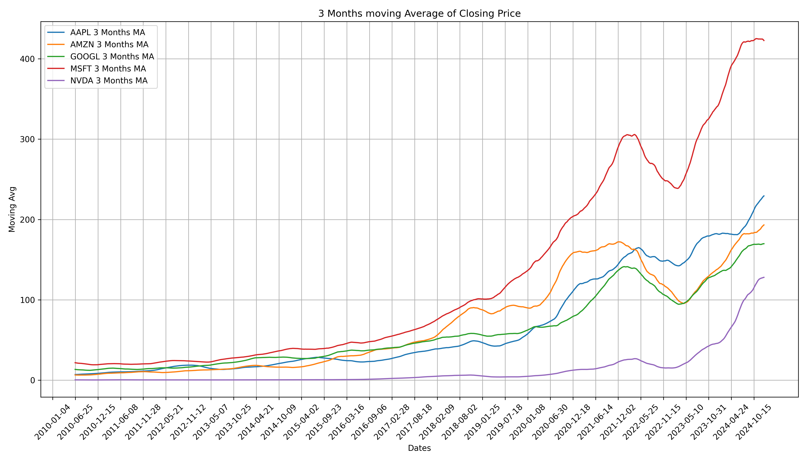

📈 Stock Market Data Visualizer – Powered by Matplotlib & Pandas
Welcome to an insightful exploration of top tech stocks through the power of data visualization. In this project, we dive deep into the historical stock data of Apple (AAPL), Amazon (AMZN), Google (GOOGL), Microsoft (MSFT), and NVIDIA (NVDA) to answer some key questions with stunning plots and clear analysis.

📦 Dataset At a Glance
Each entry in the dataset includes:

📅 Date

📈 Open, High, Low, Close prices

📊 Volume traded
...for all 5 companies.

Total rows: 86,600+ — Yep, that’s a lot of stock action! 😎

🔍 What Did We Analyze?
We picked 5 core questions and answered them with clean, professional-looking plots:

1️⃣ How did the closing price change over time?
➡️ Line plots for each stock showing clear price trends and movement.

2️⃣ Which company had the highest trading volume over time?
➡️ Volume curves with the most active days highlighted.

3️⃣ Which stock had the largest single-day price swing (High - Low)?
➡️ Bar graph comparison across all stocks.
💡 Spoiler: One stock really spiked!

4️⃣ Who wins the volatility game?
➡️ We calculated the standard deviation of closing prices to find the most unstable stock.
👀 MSFT leads in volatility!

5️⃣ Which stock had the steadiest growth?
➡️ 30-day Moving Average plots to spot consistent performers.

🛠 Tools Used
Pandas 🐼 – for data wrangling

Matplotlib 📉 – for beautiful graphs

Jupyter Notebook / Python – to code it all out

